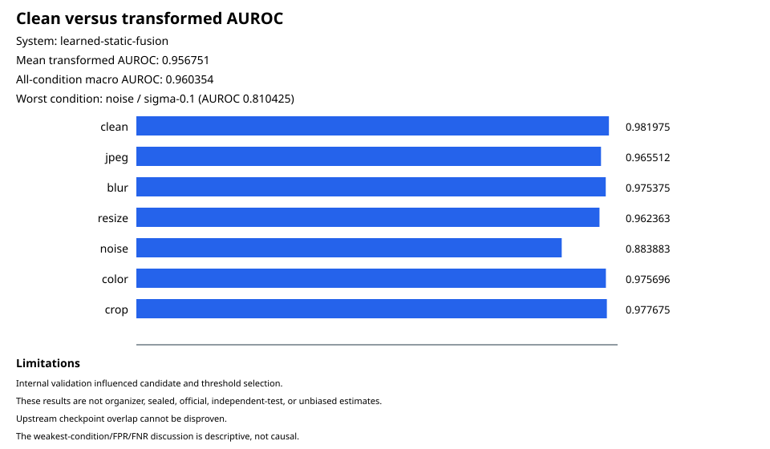

# Adaptive AIGC Forensics

## Project overview

Adaptive AIGC Forensics estimates whether an image is AI-generated while making robustness under JPEG recompression, blur, resizing, noise, color changes, and cropping explicit. The submitted system combines a frozen RGB expert with a compact signal expert through **learned-static-fusion**.

The predictor accepts an image directory and writes a deterministic JSON file with one confidence score per image.

## Architecture

- **RGB expert:** the frozen Community Forensics ViT-S/16 384 checkpoint with 21,811,969 parameters. It supplies learned RGB evidence from normalized pixels.
- **Signal expert:** a deterministic 26-value signal representation of frequency and residual statistics followed by a 26→16→1 tanh MLP with 449 trainable scalar parameters (416 + 16 + 16 + 1).
- **Learned static fusion:** calibrated expert logits combined at **0.677 RGB / 0.323 signal**. The allocation is fixed for every image.

Both experts process the same decoded, orientation-corrected RGB observation. The runtime verifies the model, normalization, preprocessing, calibrator, and fusion bindings before constructing either expert.

### Why Community Forensics 384

We selected the revision-pinned Community Forensics ViT-S/16 384 checkpoint because its upstream training directly targets cross-generator generalization. Park and Owens [trained the classifier end-to-end](https://arxiv.org/html/2411.04125v2) on a **5.4-million-image class-balanced corpus**: **2.7 million generated images** from **4,803 generator models**, paired with **2.7 million real images**. Their CVPR 2025 experiments associate broader generator diversity with stronger performance on unseen generator families. These are upstream selection findings, not results produced by this repository or guarantees for every new generator.

The [official upstream evaluation](https://huggingface.co/datasets/OwensLab/CommunityForensics-Eval) reports that the 384-pixel model outperformed the 224-pixel model across its comprehensive benchmark. We therefore chose the higher-resolution release so inference retains its 384×384 input crop instead of using the separately trained 224×224 fallback; we do not claim that input resolution alone causes the performance difference. The exact 21,811,969-parameter footprint of our pinned checkpoint is practical for a two-expert pipeline, while leaving the complementary branch as a compact 449-scalar MLP. The upstream paper also evaluates JPEG compression and Gaussian blur, as well as resizing; the robustness results below are our separately labeled internal-validation measurements of the complete fused system.

In this project the upstream checkpoint is frozen. It contributes learned RGB evidence, while the signal expert supplies explicit **FFT-energy, neighbouring-pixel, and residual statistics**. Learned static fusion combines their calibrated logits at the fixed **0.677 RGB / 0.323 signal** allocation for every image. This pairs a broad learned forensic prior with explicit low-level evidence without adding a second large image backbone.

Generator diversity is not image-level proof of non-overlap. The public [Community Forensics dataset card](https://huggingface.co/datasets/OwensLab/CommunityForensics) does not provide a complete image-level training ledger, so organizer images remain evaluation-only and locally controlled training sources undergo exact and perceptual overlap checks. The residual provenance limitation and controls are recorded in [ADR 0001](docs/adr/0001-use-community-forensics-checkpoint-with-provenance-controls.md).

## Setup and installation

### Requirements

- Git
- Python 3.12
- Internet access for the first download of the third-party RGB checkpoint

Node.js and the SID_Set dataset are not needed for inference.

### 1. Clone the repository

```shell
git clone https://github.com/BeefyPotato/adaptive-aigc-forensics.git
cd adaptive-aigc-forensics
python -m venv .venv
```

Activate the environment:

```powershell
.\.venv\Scripts\Activate.ps1
```

```bash
source .venv/bin/activate
```

Install the inference dependencies:

```shell
python -m pip install --upgrade pip
python -m pip install --requirement requirements-rgb.txt
```

### 2. Download and verify the RGB checkpoint

The downloader pins the OwensLab revision declared in [the model manifest](config/community-forensics-models.json) and verifies SHA-256 before returning the local path.

PowerShell:

```powershell
$rgbCheckpoint = python -c "from pathlib import Path; from rgb_expert import download_checkpoint; print(download_checkpoint(resolution=384, cache_directory=Path('artifacts/checkpoints')))"
$rgbCheckpoint
```

macOS/Linux:

```bash
RGB_CHECKPOINT="$(python -c "from pathlib import Path; from rgb_expert import download_checkpoint; print(download_checkpoint(resolution=384, cache_directory=Path('artifacts/checkpoints')))")"
printf '%s\n' "$RGB_CHECKPOINT"
```

Expected RGB checkpoint SHA-256:

```text
b89f36275f3bf5e2b040eee36597a8f19db051bff9a473a9cf7b2466284fb387
```

### 3. Verify the included first-party deployment package

These files are committed under `models/track5/`:

| File | SHA-256 |
| --- | --- |
| `models/track5/signal-model.json` | `cc1e98788ef09036c916065aca1d5b62751357d9eeaba90f50fe2532b9351ab5` |
| `models/track5/static-fallback-bundle.json` | `9c80b66553d10a4fc66f443c45672434800efb0731dfe2ea59036757ba959cd2` |
| `models/track5/static-fallback.complete.json` | `8295d00d0275ee0c06423cd1c31d96e1a16671da21dae1a20aa4dda93ea94112` |

The package is bound to frozen generation `static-fallback-generation-v2-67220d1f7a2329f2c9d68d306fd77cd6a19125c66bd313be5d3c85e4bd19f181` and the fusion-bundle hash shown above.

The bundle contains aggregate calibration, fusion, evaluation, and provenance bindings. It does not contain source images, image paths, labels, per-image predictions, or third-party checkpoint bytes.

### 4. Run directory inference with `submission_inference_cli.py`

Create an input directory and place supported images inside it. Nested directories are allowed.

```shell
mkdir images
```

Canonical command (replace the checkpoint placeholder with the path printed in step 2):

```shell
python submission_inference_cli.py --image-dir ./images --bundle-dir ./models/track5 --rgb-checkpoint <checkpoint-path-printed-above> --signal-model ./models/track5/signal-model.json --output ./predictions.json --device auto --batch-size 8
```

Copy-paste PowerShell command:

```powershell
python submission_inference_cli.py --image-dir .\images --bundle-dir .\models\track5 --rgb-checkpoint $rgbCheckpoint --signal-model .\models\track5\signal-model.json --output .\predictions.json --device auto --batch-size 8
```

Copy-paste macOS/Linux command:

```bash
python submission_inference_cli.py --image-dir ./images --bundle-dir ./models/track5 --rgb-checkpoint "$RGB_CHECKPOINT" --signal-model ./models/track5/signal-model.json --output ./predictions.json --device auto --batch-size 8
```

The CLI options are:

| Option | Purpose |
| --- | --- |
| `--image-dir` | Directory searched recursively for supported images |
| `--bundle-dir` | Directory containing the fusion bundle and completion receipt |
| `--rgb-checkpoint` | Downloaded Community Forensics 384 checkpoint |
| `--signal-model` | Included first-party signal model |
| `--output` | Destination JSON file |
| `--device` | `auto`, `cpu`, or `cuda` |
| `--batch-size` | Positive inference batch size |

Supported extensions are BMP, GIF, JPEG/JPG, PNG, PPM, TIFF/TIF, and WebP. Results are sorted by stable POSIX-style relative path. A corrupt supported image, invalid artifact, unavailable explicitly requested CUDA device, or non-finite prediction aborts without publishing a partial output.

The output is a JSON array whose records contain exactly `image_path` and `pred`:

```json
[
  {"image_path": "relative/path/to/image.png", "pred": 0.73}
]
```

`pred` is a finite probability in `[0, 1]`: it is the model's estimated probability that the image is AIGC-generated, with higher values indicating greater estimated likelihood. It is a model confidence, not a provenance verdict or an autonomous moderation decision. Detailed runtime behavior is documented in [submission inference](docs/submission-inference.md).

### Verified compute profile

The checked-in [runtime and parity record](docs/submission/runtime-smoke.json) covers a CPU-only Windows 11 environment with Python 3.12.10 and PyTorch 2.8.0; CUDA was unavailable and `auto` resolved to CPU. For two checked-in images at batch size 2, the separately profiled process took **23.18 seconds** including startup, model loading, and artifact validation (**0.086 images/second**) with a peak observed working set of **466,698,240 bytes**. Explicit CPU and `auto` outputs were byte-identical. The frozen RGB expert was not retrained; the `hackathon-v1` signal-expert run was CPU-based.

## Track 5 deliverables and repository map

Public repository: [github.com/BeefyPotato/adaptive-aigc-forensics](https://github.com/BeefyPotato/adaptive-aigc-forensics)

The solution is separated into focused components with module-level documentation, command-line entry points, contract tests, and linked implementation guides. The tables below map each Track 5 deliverable and solution responsibility to its location.

### Submission deliverables

| Track 5 deliverable | Location |
| --- | --- |
| Written project description | Devpost Project Story (external submission surface; not duplicated in this repository) |
| Public code / GitHub repository | This [`README.md`](README.md), the directory inference [`submission_inference_cli.py`](submission_inference_cli.py), validated runtime [`submission_inference.py`](submission_inference.py), and deployable [`models/track5/`](models/track5/) package |
| Demo video | Public YouTube video linked from Devpost (external submission surface; video and recording materials are not stored here) |
| Robustness evaluation summary | [Clean-versus-transformed report](docs/submission/results/robustness-and-errors.md#clean-versus-transformed) and [SVG summary](docs/submission/results/clean-vs-transformed.svg) |
| Error analysis note | [Representative false-positive/false-negative strata](docs/submission/results/robustness-and-errors.md#error-strata) and [threshold trade-offs](docs/submission/results/robustness-and-errors.md#threshold-trade-offs) |

### Supporting reproducibility artifacts

| Artifact | Repository location |
| --- | --- |
| Frozen first-party deployment package | [Signal model](models/track5/signal-model.json), [fusion bundle](models/track5/static-fallback-bundle.json), and [completion receipt](models/track5/static-fallback.complete.json) |
| Revision-pinned RGB checkpoint metadata | [`config/community-forensics-models.json`](config/community-forensics-models.json) |
| Candidate-bound evidence | [Evidence JSON](docs/submission/evidence/submission-evidence.json) and [evidence receipt](docs/submission/evidence/submission-evidence.complete.json) |
| Report integrity receipt | [`docs/submission/results/submission-report.complete.json`](docs/submission/results/submission-report.complete.json) |
| Evidence and report generators | [`submission_evidence.py`](submission_evidence.py) and [`submission_report.py`](submission_report.py) |
| Runtime, parity, and compute record | [`docs/submission/runtime-smoke.json`](docs/submission/runtime-smoke.json) |
| Dataset, model, library, and license records | [`docs/submission/attributions.md`](docs/submission/attributions.md) |
| Quantitative-claim provenance | [`docs/submission/claim-ledger.md`](docs/submission/claim-ledger.md) |

### Solution code map

| Component | Core implementation |
| --- | --- |
| Public directory inference | [`submission_inference_cli.py`](submission_inference_cli.py) and [`submission_inference.py`](submission_inference.py) |
| Shared image decoding, geometry, and atomic publication | [`shared_observation.py`](shared_observation.py) and [`safe_output.py`](safe_output.py) |
| Frozen RGB expert and baseline evaluation | [`rgb_expert.py`](rgb_expert.py) and [`rgb_baseline.py`](rgb_baseline.py) |
| Signal representation, maps, and bounded training | [`signal_expert.py`](signal_expert.py), [`signal_maps.py`](signal_maps.py), and [`signal_pipeline.py`](signal_pipeline.py) |
| Calibration and learned static fusion | [`fusion_pipeline.py`](fusion_pipeline.py) |
| Source inventory, source-level splits, balancing, and leakage audit | [`src/source-inventory.js`](src/source-inventory.js), [`src/track5-manifest.js`](src/track5-manifest.js), [`src/balanced-sampler.js`](src/balanced-sampler.js), [`src/leakage-audit.js`](src/leakage-audit.js), and [`src/track5-pipeline.js`](src/track5-pipeline.js) |
| Corruption definitions and deterministic materialization | [`src/track5-conditions.js`](src/track5-conditions.js), [`src/corruption-harness.js`](src/corruption-harness.js), [`src/materialized-observations.js`](src/materialized-observations.js), and [`scripts/materialize-track5-observations.mjs`](scripts/materialize-track5-observations.mjs) |
| Submission evidence and report generation | [`submission_evidence.py`](submission_evidence.py) and [`submission_report.py`](submission_report.py) |
| Reproducible environments and verification | [`requirements-rgb.txt`](requirements-rgb.txt), [`requirements-signal.txt`](requirements-signal.txt), [`package-lock.json`](package-lock.json), and [`tests/`](tests/) |

## Robustness evaluation

The following results are for the source-disjoint **internal validation** set. They are development evidence, not an official organizer score.

| Condition | AUROC |
| --- | ---: |
| Clean | 0.981975 |
| JPEG | 0.965512 |
| Blur | 0.975375 |
| Resize | 0.962363 |
| Noise | 0.883883 |
| Color | 0.975696 |
| Crop | 0.977675 |

- Mean transformed AUROC: **0.9567506944444445**
- All-condition macro AUROC: **0.9603541666666667**
- Weakest persisted condition: **noise / sigma-0.1 / 0.810425**



At the provisional internal-validation thresholds, the signal expert corrected **768/1218 = 0.6305418719211823** calibrated-RGB errors. Learned static fusion improved all-condition macro AUROC over calibrated RGB-only by **0.016795535714285936**, with a deterministic source-bootstrap interval of **[0.011076105794972707, 0.0234869800759804]**. This is descriptive evidence, not a causal attribution.

The [robustness and error report](docs/submission/results/robustness-and-errors.md) includes deterministic, sanitized clean/transformed false-positive and false-negative representatives plus the threshold trade-off (balanced accuracy, false-positive rate, and false-negative rate).

## Reproduce the reported results

### Re-render the checked-in report

The completed sanitized evidence is tracked, so the public Markdown/SVG report can be regenerated without the training images or private evaluation caches:

Create the output parent directory once:

```powershell
New-Item -ItemType Directory -Force ./artifacts/submission-reproduction | Out-Null
```

```bash
mkdir -p ./artifacts/submission-reproduction
```

```shell
python submission_report.py ./docs/submission/evidence ./artifacts/submission-reproduction/results
```

The generated files can be compared with:

- `docs/submission/results/robustness-and-errors.md`
- `docs/submission/results/clean-vs-transformed.svg`
- `docs/submission/results/submission-report.complete.json`

### Run the verification suites

```shell
python -m unittest tests.test_submission_evidence tests.test_submission_report tests.test_submission_docs tests.test_submission_inference tests.test_submission_inference_cli -v
python -m unittest discover -s tests -p "test*.py" -v
npm ci
npm test
```

### Reproduce training and evaluation

Full experiment reproduction additionally requires Node.js 22, SID_Set under its original terms, and substantially more compute and storage:

```shell
python -m pip install --requirement requirements-signal.txt
npm ci
node ./scripts/download-sid-set-candidates.mjs
node ./src/track5-cli.js build-manifest --inventory ./datasets/sid-set/inventory.jsonl --dataset-root ./datasets/sid-set/images --dataset-revision "saberzl/SID_Set@dc03ead57929879319ce30a82bfcfb8d317b10bd" --output-dir ./artifacts/track5-production
node ./scripts/materialize-track5-observations.mjs --manifest ./artifacts/track5-production/track5-manifest.json --dataset-root ./datasets/sid-set/images --output-dir ./artifacts/track5-materialized --concurrency 4
```

The source-level allocation contains **8,000 expert-training sources**, **2,000 fusion-training sources**, **2,000 internal-validation sources**, and **2,000 sealed-internal-test sources**. Source identities do not cross partitions. Selection rejects exact and perceptual matches across partitions and deterministically backfills from the pinned reserve without relaxing the split quotas.

Preserve this sequence: source split and leakage audit; corruption materialization; frozen RGB scoring; signal-expert training; calibrator and static-weight fitting on fusion training; internal-validation candidate and threshold diagnostics; then report generation. The sealed internal test set and organizer demonstration set remain outside development decisions.

The published `hackathon-v1` signal run used **8,064 training draws**, **400 validation sources**, and **8,000 validation observations**. Its frozen revisions are:

- checkpoint: `signal-checkpoint-v1-4a6b4d974722c9f8729a90d872387bb49e54d01e7bda98ddb69232c28604390e`
- normalization: `signal-normalization-v1-25b16b78f7ecb5e02572e03650537e8b5e266f2f3e49a911a2ae2e2e11d45e80`

Use these public guides for the heavyweight workflow:

- [Dataset access and restrictions](docs/data-sources.md)
- [Manifest, split, leakage, and corruption generation](docs/track5-manifest.md)
- [RGB expert and checkpoint acquisition](docs/rgb-expert.md)
- [RGB robustness baseline](docs/rgb-baseline.md)
- [Signal representation and training](docs/signal-expert.md)
- [Static fusion fitting and selection](docs/static-fusion-fallback.md)

Organizer-provided evaluation data is evaluation-only and must not influence training, calibration, model selection, weights, thresholds, or reporting choices.

## Limitations and future work

- Public Community Forensics metadata does not provide an image-level ledger proving that every organizer image was absent from its upstream training data.
- Learned static fusion uses one allocation for every image; it does not adapt trust according to the observed degradation.
- The reported metrics come from internal validation that influenced development decisions and are not an unbiased external evaluation.
- Confidence scores should support human review, not replace provenance investigation or moderation policy.
- Full training reproduction is resource intensive; inference and report rendering are the lightweight reproducible paths.

Further work includes evaluation on unseen generators and transformations, external calibration studies, and independent organizer-set evaluation without changing the selected system.

## Attributions

Dataset, upstream model, checkpoint, framework, and library attribution details are recorded in [`docs/submission/attributions.md`](docs/submission/attributions.md). The Community Forensics checkpoint is downloaded separately under its upstream terms; no third-party model weights or restricted dataset images are stored in this repository.
